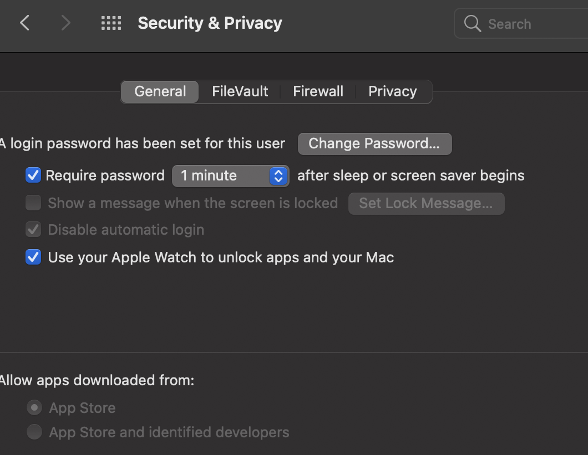
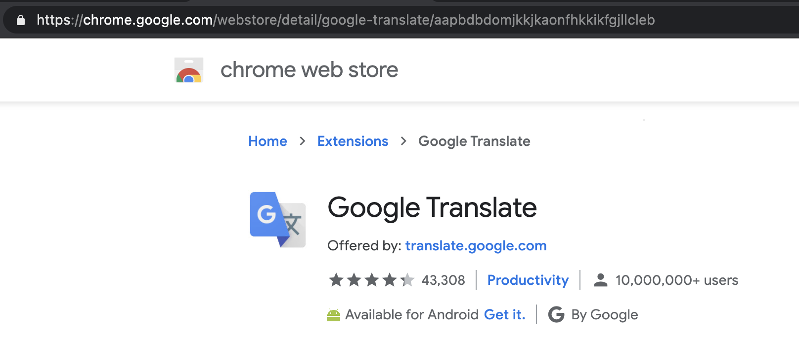
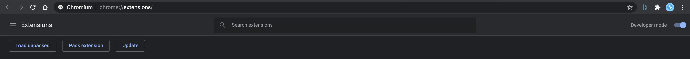

# Development issues - macOS 
Issues and their solutions (*if any*) that are encountered in a predominantly `C++` oriented development workflow on macOS. 
The solutions for each of the issues are presented in separate documents, together with the documentation that helped into fixing that particular issue.
The repository also contains various files that are required for fixing certain issues. 

Thank you to all the development communities (e.g. [Stack Overflow](https://stackoverflow.com/questions]), [GitHub](https://github.com/) and many more) that have solutions for most of the issues. Even if the solution to a particular issue is missing, a *piece-by-piece* puzzle building procedure can be applied, which will result in eventually getting the problem to stop.


**Disclaimer**: I do not own any rights on this documentation. Everything that is contained in this repository was put together from *open-access* communities and *open-source* official documentation of the respective packages that were used here.

**Important aspects** (to take into consideration if one decides to try these fixes)

* They were all tried/tested on a MacBookPro with at least macOS 10.15 (Catalina)
* The earliest version of XCode which this machine had installed was `11.3`
* The earliest version for the Command Line Tools which was installed on the machine was 11.3
* Compilation of `C++` sources was done with the `clang` compiler that comes with XCode (no additional compiler(s) was(were) installed)
* These fixes might but might also **not** work for you, depending on the version of OS, compilers and actual development enviroments. 

## Content

1. [Issues](issues.md)
2. [Resources](documentation.md)
3. [🌟 New Resources](bigsur.md) - macOS 11 BigSur


### Ungoogled-chromium

Installed via Homebrew. [here](https://formulae.brew.sh/cask/eloston-chromium). Using latest version for macOS BigSur. 

It does require Security Permissions in order to run, after installation.
Extensions work only with **.crx format files**.

Steps for getting an extension:

1. Choose extension from the [*Chrome web store*](https://chrome.google.com/webstore/category/extensions)
2. Get the link of the extension and use it for next step (get `.crx` file)

3. [Get the .crx format extension](https://crxextractor.com/)
4. For macOS: In **terminal**, go to the location of the `crx.` file that was downloaded, then extract it with `unzip` command like so:
```shell
unzip extension-file.crx
```
5. Settings -> Extensions -> Turn on Developer mode -> **Load unpacked**

6. Select the folder with the extracted extension (that was obtained from step 4.)
7. Extension should properly install.