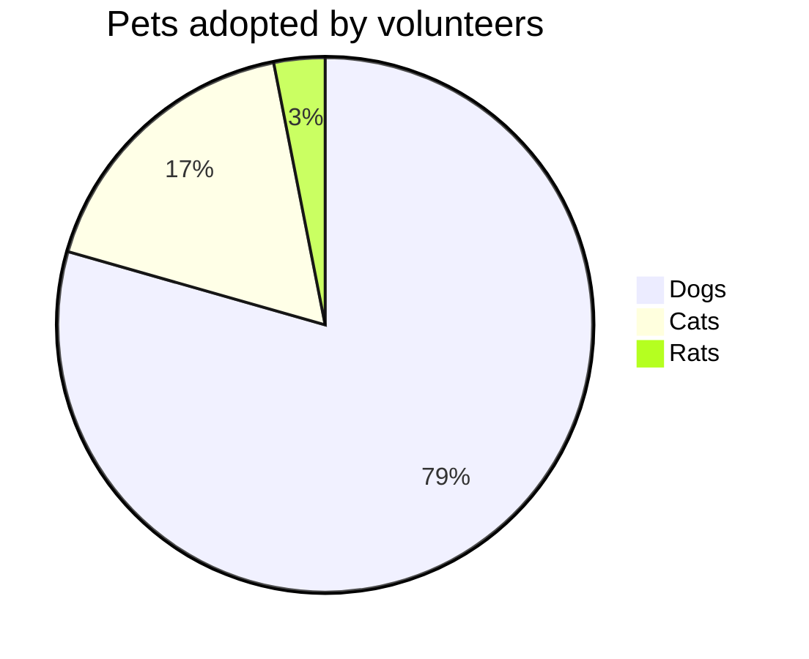
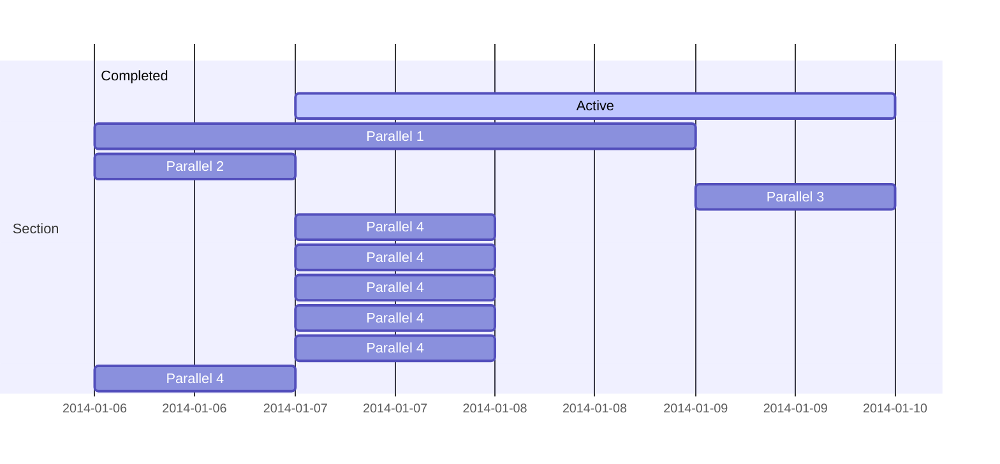

# `C++` development issues

This document contains the issues which prevented a proper workflow in `C++`projects:

* prevent proper source(s) compilation
* prevent proper code execution on the machine (via command line)
* prevent proper linking of different executables with their respective necessary libraries.

