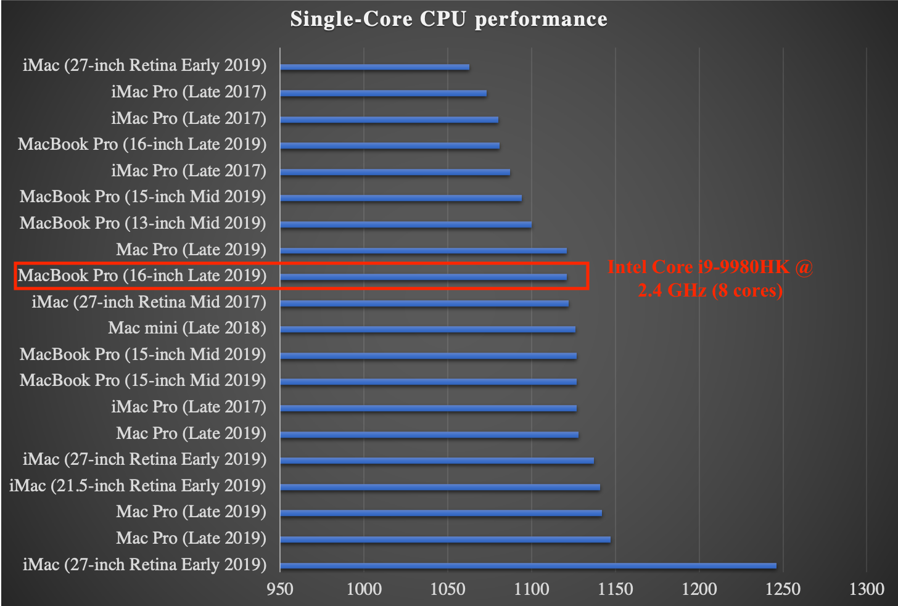

# MacBook Pro - benchmark results

The latest MacBook Pro released by Apple is the 16" model (which launched in November 2019).
The laptop comes with two variants:

* A 6-core CPU - Intel Core i7-9750H, clocked at 2.6GHz
* An 8-core CPU - Intel Core i9-9980HK, clocked at 2.3GHz

## Measuring performance on the 16" MacBook Pro (late 2019 model)

My current 16"MBP has the 8-core CPU, with the top of the line i9, clocked at 2.4Ghz base frequency (an extra 100MHz compared to the cheaper version with the same i9).

This i9 was tested through various benchmark tools, and a comparison with other Apple machines can be seen in the graphs below.

### Geekbench 5 - performance measurement

#### Single-core performance

> higher is better

#### Multi-core performance

> higher is better

<!--  -->
